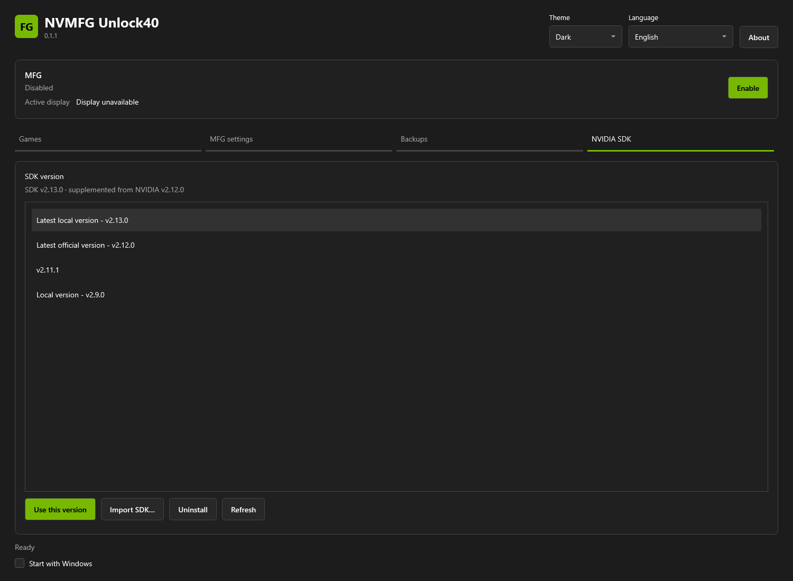

<!-- nv-language-navigation:start -->
🌐 [English](../../../../NVMFG-Unlock40/README.md) | [Français](../../../../NVMFG-Unlock40/README.fr.md) · [NV Laboratory](../README.md)

🌐 Language · 34

[العربية](../../ar/NVMFG-Unlock40/README.md) · [বাংলা](../../bn/NVMFG-Unlock40/README.md) · [简体中文](../../zh/NVMFG-Unlock40/README.md) · [Čeština](../../cs/NVMFG-Unlock40/README.md) · **Dansk** · [Nederlands](../../nl/NVMFG-Unlock40/README.md) · [English](../../../../NVMFG-Unlock40/README.md) · [Filipino](../../fil/NVMFG-Unlock40/README.md) · [Suomi](../../fi/NVMFG-Unlock40/README.md) · [Français](../../../../NVMFG-Unlock40/README.fr.md) · [Deutsch](../../de/NVMFG-Unlock40/README.md) · [Ελληνικά](../../el/NVMFG-Unlock40/README.md) · [हिन्दी](../../hi/NVMFG-Unlock40/README.md) · [Magyar](../../hu/NVMFG-Unlock40/README.md) · [Bahasa Indonesia](../../id/NVMFG-Unlock40/README.md) · [Italiano](../../it/NVMFG-Unlock40/README.md) · [日本語](../../ja/NVMFG-Unlock40/README.md) · [한국어](../../ko/NVMFG-Unlock40/README.md) · [मराठी](../../mr/NVMFG-Unlock40/README.md) · [فارسی](../../fa/NVMFG-Unlock40/README.md) · [Polski](../../pl/NVMFG-Unlock40/README.md) · [Português](../../pt/NVMFG-Unlock40/README.md) · [ਪੰਜਾਬੀ](../../pa/NVMFG-Unlock40/README.md) · [Română](../../ro/NVMFG-Unlock40/README.md) · [Русский](../../ru/NVMFG-Unlock40/README.md) · [Español](../../es/NVMFG-Unlock40/README.md) · [Kiswahili](../../sw/NVMFG-Unlock40/README.md) · [Svenska](../../sv/NVMFG-Unlock40/README.md) · [தமிழ்](../../ta/NVMFG-Unlock40/README.md) · [ไทย](../../th/NVMFG-Unlock40/README.md) · [Türkçe](../../tr/NVMFG-Unlock40/README.md) · [Українська](../../uk/NVMFG-Unlock40/README.md) · [اردو](../../ur/NVMFG-Unlock40/README.md) · [Tiếng Việt](../../vi/NVMFG-Unlock40/README.md)

[Translation policy](../../README.md)

<!-- nv-language-navigation:end -->

<!-- nv-translation-notice:start -->
> Maskinassisteret oversættelse fra engelsk. Tekniske navne, kommandoer, URL'er og originale lovtekster er bevaret. Native-speaker anmeldelse er velkommen; se den engelske reference, hvis ordlyden er uklar.
<!-- nv-translation-notice:end -->

# NVMFG Unlock40

**Eksperimentel NVIDIA Multi Frame Generation til GeForce RTX 40, med en central controller og valgmuligheder pr. spil.**

[Download 0.2.3 & status](../docs/downloads.md#nvmfg-unlock40) · [Installation](#installation) · [Opstrøms](#upstream-and-modifications) · [Licenser](LICENSES/README.md)

## Overblik og formål

NVMFG Unlock40 er en uafhængigt udviklet applikation af 禅堂 Zendo (RevoluSound Team). Den kombinerer en Windows-controller, et indbygget lag, en profilhjælper og spil/Streamline SDK-styring. Det er rettet mod spil, der allerede integrerer NVIDIA DLSS Frame Generation og kompatible NVIDIA runtimes.

[RTX40MFG-Unlock](https://github.com/dashdogy/RTX40MFG-Unlock) blev konsulteret for at sammenligne og forfine arbejdet. Det nuværende indbyggede lag indeholder delte og tilpassede komponenter, krediteret individuelt nedenfor. Denne reference gør ikke hele NVMFG-applikationen til en fork for det pågældende projekt.

Den eksisterer for at koordinere eksperimentel MFG-adfærd centralt, huske spilspecifikke valg og holde runtime-opdateringer og sikkerhedskopier synlige. Det tilføjer ikke DLSS Frame Generation til hvert spil eller konverterer en vilkårlig FSR-implementering.

Den nuværende pakke er **0.2.3**. Det tilføjer et vedvarende spilbibliotek, aktivitets- og kapacitetsoplysninger, lokal diagnostik og korrigeret valg/fremskridtsadfærd. [Downloads](../docs/downloads.md#nvmfg-unlock40) identificerer de nøjagtige filer og hashes.

## Funktioner

- Central aktivering/deaktivering af kontrol og valgfri Windows-bakkestart.
- Per-spil valg mellem Dynamic MFG, spillets indstilling og understøttede faste multiplikatorer.
- Adskil huskede valg for observerede V-Sync tænd/sluk-tilstande.
- Dynamic bruger NVIDIA's tilstand; den er suspenderet, når V-Sync er slukket, med et separat in-game/fast valg.
- Spilmenuvejledning og vedvarende udelukkelser; spil uden DLSS FG bevarer kontrollen.
- Spilopdagelse, valg af forældremappe, søgning, gruppering og fjernelse uden at slette spilfiler.
- Streamline SDK download/import, verificeret lokal cache, eksplicit valg, sikkerhedskopiering og gendannelse pr. spil.
- Native provider-bekræftelse, per-session-diagnostik, global profiljournal og konfliktbevidst genopretning.
- 34 grænsefladesprog og fire temaer.

Slår FG fra i spillet, holder det det slukket. Faste valg fra 2x til 6x afhænger af spillet/menuen/runtime; de er ikke et løfte om, at hver kombination virker. Controlleren observerer V-Sync og indstiller ikke V-Sync eller VRR for brugeren.

## Kompatibilitet

| Krav | Detaljer |
| --- | --- |
| System | Windows 10/11 x64 |
| GPU | GeForce RTX 40 mål; ingen universel GPU-kompatibilitetspåstand |
| Spil | Eksisterende NVIDIA DLSS Frame Generation integration og understøttet runtime; ingen anti-cheat-kompatibilitetscertificering |
| Udbyder | Kandidaten er fastgjort til udbyderen SHA-256 dokumenteret i [herkomst](../docs/provenance.md); ukendte hashes afvises |
| Runtime | Medfølgende .NET 8/WPF 8.0.30 til app/agent; .NET Framework 4.8 til profilhjælpere |
| Tilladelser | Administratoradgang til controlleren/profilhandlingerne |
| Netværk | Påkrævet for udvalgte officielle SDK-downloads; importerede kompatible SDKs kan cachelagres lokalt |
| Eksterne binære filer | NVIDIA driver, NGX udbyder/modeller og Streamline spil runtime er ikke bundtet |

En versionsetiket alene er utilstrækkelig: driver, udbyder-hash, spilintegration og faktisk indlæste moduler betyder noget. Beskyttede eller inkompatible processer kan nægte tilknytning. Applikationen er ikke designet til at undgå beskyttelse mod snyd.

## Installation

1. Læs [kandidatstatus og licensnotat](../docs/downloads.md#nvmfg-unlock40).
2. Download `NVMFGUnlock40-0.2.3-Setup-x64.exe` eller `NVMFGUnlock40-0.2.3-Portable-x64.zip`, når dens udgivelse er tilgængelig.
3. Tjek SHA-256 og gem de medfølgende meddelelser. Installer .NET Framework 4.8, hvis Windows ikke allerede leverer det.
4. Kør installationsprogrammet, eller udtræk **hele** bærbare ZIP til en skrivbar lokal mappe.
5. Start `NVMFGUnlock40.exe`; behold `agent`, `driver`, `engine` og `Licenses` i det medfølgende layout.

Mappen med navnet `driver` indeholder brugerrumshjælpere, ikke en kernedriver. Kopier ikke kun den primære EXE eller udskift udbyderens hash for at tvinge kompatibilitet. De nuværende EXE'er er usignerede.

## Brug

1. Start med controlleren deaktiveret. Tilføj et spil eller en overordnet mappe, og vælg de faktiske installationer.
2. Gennemgå hvert spils MFG-indstillinger. Svar på, hvad menuen tilbyder; svaret gemmes pr. spil.
3. Vælg Dynamic eller indstillingen i spillet globalt, og juster derefter kvalificerede valg pr. spil efter behov.
4. Aktiver kun controlleren, når du har til hensigt at bruge den. Den kan midlertidigt ændre seks globale NVIDIA-profilindstillinger med en gendannelsesjournal.
5. Start et kvalificeret spil og aktiver dets eget DLSS Frame Generation. Følg enhver anmodning om V-Sync-off-valget.
6. Brug ekskluderinger for spil, du ikke ønsker administreret. Fjernelse af et spil registrerer en ekskludering og bevarer dets filer/sikkerhedskopier.
7. Brug programmets fulde afslutnings-/deaktiverings- og gendannelsesflow, når du er færdig.

Lukning af hovedvinduet kan efterlade controlleren i bakken. En DLL, der allerede er indlæst i et spil, forbliver der, indtil spillet afsluttes; Deaktivering af controlleren er ikke en aflæsningsgaranti. Luk berørte spil før vedligeholdelse eller opdateringer.

**Streamline SDKs:** på siden NVIDIA SDK skal du downloade en officiel version eller importere en kompatibel lokal SDK. Import gemmer en bekræftet kopi; **Use this version** vælger det, og **Uninstall** fjerner den cachelagrede kopi. Manglende Streamline DLL'er kan suppleres fra en officiel NVIDIA SDK, med kilden vist. Dette downloader/erstatter ikke en NGX-model. Luk spillet, vælg den tilsigtede spilopdatering, og behold dens originale backup. For at gendanne spilfiler skal du bruge dens backupgendannelse, ikke cachens Uninstall-knap.

## Bibliotek, diagnostik og opdateringer

**Persistent bibliotek:** vælg flere spilmapper, inklusive forskellige drev, før du starter én scanning. Fremskridt er synligt, og annullering er tilgængelig. Efter den første scanning gendanner en lokal cache biblioteket ved lancering uden at gå i hver spilmappe. Opdater for at finde ændringer eller tilføje en anden mappe. Vedligeholdelsesoperationer genvaliderer stadig de berørte filer; backup-overvågning forbliver aktiv. Cachen er gemt på `%LOCALAPPDATA%\RtxMfg\library-cache.json`.

**Udvalg:** Ctrl+A vælger alle, og Ctrl+D rydder den aktive fane Spil eller Sikkerhedskopier. Intet spil vælges automatisk. Aktivitetsopdateringer og -opdateringer skaber ikke længere spøgelsesvalg eller inkonsekvente optællinger.

**Aktivitet og kompatibilitet:** MFG-oplysninger pr. spil kommer fra NGX-observationer uden en ny overlejring. Det er ikke en fysisk optælling af viste rammer. Dynamic-med-V-Sync-understøttelse kommer fra runtime-funktioner; ukendt kapacitet er ikke udledt af et versionsnummer. Applikationen ændrer hverken V-Sync eller VRR. Når V-Sync er slået fra, forbliver Dynamic suspenderet; faste eller spilkontrollerede valg er separate.

**Næste lancering:** den midlertidige udelukkelse springer patching over ved næste spillancering og gendanner normal administration, efter at den afsluttes. Det kan ikke fjerne en DLL, der allerede er indlæst i et spil: luk og genstart spillet. Wallpaper Engine er anerkendt som en desktop-applikation; denne rettelse bevarer beskyttelsen for faktiske ignorerede spil.

**Præferencer og support:** præferenceimport/eksport kræver manuel gentilknytning af spilmapper. Den lokale diagnostik i Om filtrerer private oplysninger og rapporterer tilgængelige NVAPI fejlkoder eller konfliktkategorier. Gennemgå det før deling; intet uploades automatisk.

**Applikationsopdateringer:** et valgfrit tjek viser udgivelsesbemærkninger og tilbyder den officielle opsætning. Den eksplicitte download kontrolleres mod GitHub størrelse og SHA-256 metadata; du påbegynder installationen selv. Version 0.2.3 rydder også afsluttede fremskridtsmeddelelser, mens meningsfulde fejl og resultater bevares. Disse tilføjelser inkluderer ændringerne siden den offentlige version 0.1.1.

## Skærmbilleder

Eksisterende engelsk 0.1.1-grænseflade gengives med et eksempel på SDK-beholdning. Det er ikke en aktuel versionsliste eller bevis på et kørende spil. [Billedets oprindelse](../assets/README.md).

## Opdater og afinstaller

Luk berørte spil. Deaktiver/luk NVMFG, og løs enhver afventende gendannelse af NVIDIA-indstillinger før opdatering. Installer den næste opsætning med den eksisterende identitet, eller udpak den nye bærbare i en ny mappe; beholde tilstand/sikkerhedskopier.

Inden du afinstallerer, skal du gendanne de ønskede SDK-sikkerhedskopier og NVIDIA-indstillinger gennem programmet, og luk derefter spil og luk controlleren. Brug Windows **Installed apps** til opsætning, eller fjern den lukkede bærbare mappe efter at have bevaret de nødvendige filer. Slet ikke en aktiv genoprettelsesjournal manuelt for at fjerne blokeringen af ​​opsætning.

Lokale spil-runtime-sikkerhedskopier bruger `%LOCALAPPDATA%\NvidiaStreamlineMaintenance\Backups`. MFG-indstillinger/SDK-data bruger `%LOCALAPPDATA%\RtxMfg`; sessionsoutput er under `Sessions` ved siden af ​​applikationen. Disse filer kan indeholde spilstier. Indsend dem ikke uredigerede.

## Kendte begrænsninger

- En rapporteret 0.1.1 aktiverings-/gendannelses-/afinstallationsblokering forbliver ikke-reproduceret, og dens årsag er ukendt. Denne udgivelse hævder ikke at rette det. Efter en fejl, gem genoprettelsesjournalen og inspicér den lokale diagnostik; fremtving ikke sletning af gendannelsesdata.
- Eksperimentelle native patches kan forårsage nedbrud eller visuelle artefakter; et uløst Bodycam-nedbrud er registreret i udviklingshistorien.
- Kontrollerede gengivelsestest er ikke certificering for hvert spil, driver eller anti-cheat.
- Genererede rammer opretter ikke nye input-eksempler; ingen målt latenstid eller ydelsesforøgelse loves af denne hub.
- Flere frame-genereringsværktøjer/overlays kan være i konflikt. Applikationen rapporterer observerede moduler uden at bevise ethvert sameksistensscenarie.
- Kompatibilitetsmanifestet er en detektionshjælp, ikke en liste over fuldt testede spil.
- Fuldstændige NVIDIA SDK vilkår og den uløste tekniske begrænsning forbliver dokumenteret i [herkomst](../docs/provenance.md).

## Fejlfinding

| Symptom | Handling |
| --- | --- |
| Udbyder understøttes ikke | Behold de originale verificerede filer. Rapporter driver/udbyderversioner og fejlen; omgå ikke hash-tjekket. |
| Ingen DLSS FG i spillet | Vælg det svar og lad spillet være i kontrol; dette værktøj kan ikke fremstille denne integration. |
| Spil går ned/artefakter | Afslut spillet, deaktiver NVMFG, brug spillets originale runtime backup, hvis det blev ændret, og rapporter reproducerbare detaljer. |
| SDK liste eller download er ikke tilgængelig | Opdater og tjek den officielle kilde; en cachelagret/importeret version skal stadig bestå validering. |
| Afventende NVIDIA-gendannelse blokerer afslutning/opdatering | Brug recovery og bevar journalen; konflikter må ikke overskrives blindt. |
| Et fjernet spil genfindes ikke | Dens udelukkelse er vedvarende. Tilføj det eksplicit, når du vil have det administreret igen. |

[Fælles supportvejledning](../docs/support.md) forklarer, hvad der skal medtages i en rapport.

## FAQ

**Indeholder det NVIDIA DLL'er eller modeller?** Ingen driver, NGX udbyder/model eller Streamline runtime er inkluderet. Eksplicitte SDK-downloads kommer fra NVIDIA.

**Fungerer Dynamic med V-Sync slukket?** Den er suspenderet i den tilstand. Vælg indstillingen i spillet eller en kvalificeret fast multiplikator for det pågældende spils separate tilstand.

**Er dette en ReShade/OptiScaler/FSR-pakke?** Nej. Disse er ikke kompileret eller afsendt som en del af denne produktionspakke.

**Er de modificerede kilder offentlige?** Nej. Kompilerede pakker og påkrævede kreditter/licenser leveres. Dette fjerner ikke tredjeparters rettigheder eller begrænsninger.

## Upstream og modifikationer

Sammenligningsreference og delte indbyggede komponenter: **RTX40MFG-Unlock af Michael Robles / dashdogy**, reference commit `4e776d068f91b4a665425542bb005dd57cc3d891`, MIT. [Depot](https://github.com/dashdogy/RTX40MFG-Unlock) · [Originale downloads](https://github.com/dashdogy/RTX40MFG-Unlock/releases).

Kildesammenligningen identificerer delt patching, udbyder/politikhåndtering, tidsmæssige rettelser og MinHook-baserede omvejskomponenter. Deres MIT- og BSD-meddelelser bevares. Den komplette sammenligning inkluderer også filer uden for produktionsmålet.

Desktopapplikationen, controlleren og SDK-administrationsworkflowet er udviklet af 禅堂 Zendo (RevoluSound Team). Projektarbejde omfatter central indlæsning, NGX bootstrap integration, verificeret udbydervalg, spil/V-Sync koordinering og sessionsdiagnostik. Herkomstvejledningen adskiller dette arbejde fra de delte komponenter; en filsammenligning alene fastslår ikke, hvornår nogen af ​​forfatterne havde idéen.

Profilhjælperen tilpasser MIT NVAPI-indpakningen fra Orbmu2k's Profile Inspector. [Detaljeret herkomst og komponentomfang](../docs/provenance.md).

## Credits og licens

Michael Robles; Orbmu2k; Tsuda Kageyu og HDE bidragydere; NVIDIA Corporation; Microsoft og bidragydere; Inno Setup forfattere og oversættere. Applikationsudvikling, integrationer og pakning: 禅堂 Zendo (RevoluSound Team).

[eksisterende tilladelse til deling af kompilerede pakker](../../../../NVMFG-Unlock40/LICENSE) og alle [komponentlicenser](LICENSES/README.md) er bevaret. MIT-tilladelser til upstream-kode er forskellige fra NVIDIA SDK-udtryk. Ingen generel licens erstatter dem.

Uafhængig af, ikke sponsoreret af og ikke officielt godkendt af NVIDIA Corporation. Alle refererede varemærker forbliver deres ejeres ejendom.
