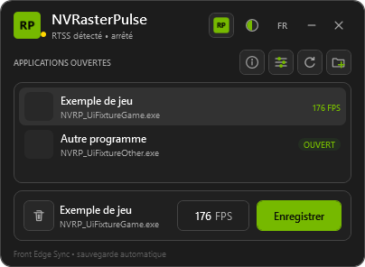

<!-- nv-language-navigation:start -->
🌐 [English](../../../../NVRasterPulse/README.md) | [Français](../../../../NVRasterPulse/README.fr.md) · [NV Laboratory](../README.md)

🌐 Language · 34

[العربية](../../ar/NVRasterPulse/README.md) · [বাংলা](../../bn/NVRasterPulse/README.md) · [简体中文](../../zh/NVRasterPulse/README.md) · [Čeština](../../cs/NVRasterPulse/README.md) · [Dansk](../../da/NVRasterPulse/README.md) · [Nederlands](../../nl/NVRasterPulse/README.md) · [English](../../../../NVRasterPulse/README.md) · [Filipino](../../fil/NVRasterPulse/README.md) · [Suomi](../../fi/NVRasterPulse/README.md) · [Français](../../../../NVRasterPulse/README.fr.md) · [Deutsch](../../de/NVRasterPulse/README.md) · [Ελληνικά](../../el/NVRasterPulse/README.md) · [हिन्दी](../../hi/NVRasterPulse/README.md) · [Magyar](../../hu/NVRasterPulse/README.md) · [Bahasa Indonesia](../../id/NVRasterPulse/README.md) · [Italiano](../../it/NVRasterPulse/README.md) · [日本語](../../ja/NVRasterPulse/README.md) · [한국어](../../ko/NVRasterPulse/README.md) · **मराठी** · [فارسی](../../fa/NVRasterPulse/README.md) · [Polski](../../pl/NVRasterPulse/README.md) · [Português](../../pt/NVRasterPulse/README.md) · [ਪੰਜਾਬੀ](../../pa/NVRasterPulse/README.md) · [Română](../../ro/NVRasterPulse/README.md) · [Русский](../../ru/NVRasterPulse/README.md) · [Español](../../es/NVRasterPulse/README.md) · [Kiswahili](../../sw/NVRasterPulse/README.md) · [Svenska](../../sv/NVRasterPulse/README.md) · [தமிழ்](../../ta/NVRasterPulse/README.md) · [ไทย](../../th/NVRasterPulse/README.md) · [Türkçe](../../tr/NVRasterPulse/README.md) · [Українська](../../uk/NVRasterPulse/README.md) · [اردو](../../ur/NVRasterPulse/README.md) · [Tiếng Việt](../../vi/NVRasterPulse/README.md)

[Translation policy](../../README.md)

<!-- nv-language-navigation:end -->

<!-- nv-translation-notice:start -->
> इंग्रजीतून मशीन-सहाय्यित भाषांतर. तांत्रिक नावे, आदेश, URL आणि मूळ कायदेशीर मजकूर जतन केले आहेत. नेटिव्ह-स्पीकर पुनरावलोकन स्वागतार्ह आहे; शब्द अस्पष्ट असल्यास इंग्रजी संदर्भ पहा.
<!-- nv-translation-notice:end -->

# NVRasterPulse

**प्रति-अर्ज FPS RivaTuner Statistics Server द्वारे मर्यादा.**

> **प्रथम RTSS स्थापित करा.** NVRasterPulse ला [RivaTuner Statistics Server (RTSS), Guru3D वरून डाउनलोड केले](https://www.guru3d.com/download/rtss-rivatuner-statistics-server-download/) आवश्यक आहे. RTSS मर्यादा लागू करण्यासाठी चालू असणे आवश्यक आहे. कोणतेही RTSS इंस्टॉलर, हुक DLL किंवा SDK बंडल केलेले नाही.

[0.1 आणि स्थिती डाउनलोड करा](../docs/downloads.md#nvrasterpulse) · [स्थापना](#installation) · [मर्यादा कसे कार्य करते](#usage) · [परवाना](../../../../NVRasterPulse/LICENSE)

## विहंगावलोकन आणि उद्देश

NVRasterPulse हा एक संक्षिप्त Windows इंटरफेस आहे जो एक्झिक्युटेबल नावाने RTSS फ्रेम मर्यादा व्यवस्थापित करण्यासाठी आहे. RTSS मर्यादित करते. NVRasterPulse संबंधित प्रोफाइल मूल्ये, बॅकअप आणि रीलोड विनंत्या, ट्रे प्रवेश आणि सतत निवडीसह व्यवस्थापित करते.

संपूर्ण RTSS प्रोफाइल बदलल्याशिवाय किंवा त्याच्या आच्छादन सेटिंग्जमध्ये अडथळा न आणता अचूक प्रति-गेम मर्यादा संपादित करणे सोपे करण्यासाठी अस्तित्वात आहे. सध्याचा **0.1** उमेदवार 9 सप्टेंबर 2026 चा आवश्यक RTSS इंस्टॉलेशन तपासणीसह बिल्ड आहे.

## वैशिष्ट्ये

- चालू असलेला अनुप्रयोग निवडा किंवा तो स्वतः चालविण्यायोग्य जोडा.
- FPS मर्यादा 1 ते 1000 पर्यंत जतन करा, तीन दशांश स्थानांपर्यंत.
- प्रविष्ट केलेल्या मूल्यांचे अचूक तर्कसंगत एन्कोडिंग: 59.94 2997/50 बनते.
- फ्रंट एज सिंक कॉन्फिगरेशन (`SyncLimiter=1`) सक्रिय प्रतीक्षा (`PassiveWait=0`) सह.
- प्रति-एक्झिक्युटेबल प्रोफाइल अद्यतने, स्वयंचलित बॅकअप आणि परमाणु लेखन.
- इतर प्रोफाइल सामग्री राखून ठेवताना लिमिटर ओव्हरराइड्स काढून टाकणे.
- RTSS इंस्टॉलेशन डिटेक्शन, मॅन्युअल पथ निवड आणि स्पष्ट लॉन्च/रीलोड.
- सिंगल-इंस्टन्स ट्रे ऑपरेशन, वैकल्पिक स्थापित स्टार्टअप, 34 भाषा आणि चार थीम.
- सामान्य क्विट आणि **क्विट + RTSS** क्रिया वेगळे करा.

## सुसंगतता

| आवश्यकता | तपशील |
| --- | --- |
| प्रणाली | Windows 10/11 x64 |
| रनटाइम | [.NET फ्रेमवर्क 4.8](https://dotnet.microsoft.com/en-us/download/dotnet-framework/net48), आवश्यक असल्यास स्वतंत्रपणे स्थापित करा |
| आवश्यक सॉफ्टवेअर | RTSS सह `RTSS.exe`, जुळणारी `Profiles` निर्देशिका आणि सुसंगत प्रोफाइल/रीलोड समर्थन |
| GPU | RTSS सुसंगतता मर्यादा निश्चित करते; या प्रोफाइल व्यवस्थापकाला विशिष्ट RTX जनरेशनची आवश्यकता नाही |
| परवानग्या | वर्तमान अनुप्रयोग प्रशासक प्रवेशाची विनंती करतो; निवडलेले RTSS प्रोफाइल फोल्डर प्रवेशयोग्य असणे आवश्यक आहे |
| खेळ | RTSS हुकिंग सपोर्ट आणि प्रत्येक गेमच्या निर्बंधांवर अवलंबून असते; फसवणूक विरोधी हमी नाही |

या हब ऑडिटद्वारे प्रत्येक कार्यासाठी कोणतीही विशिष्ट RTSS किमान आवृत्ती प्रमाणित केलेली नाही. अधिकृत वर्तमान वितरण वापरा आणि प्रोफाइल की/रीलोड कार्य करत नसल्यास अचूक आवृत्तीचा अहवाल द्या. स्थापित-परंतु-थांबलेले RTSS स्थापना तपासणी पास करते; त्यानंतर प्रत्यक्ष मर्यादा घालण्यासाठी ते सुरू करणे आवश्यक आहे.

## स्थापना

1. **[Guru3D वरून RTSS डाउनलोड आणि स्थापित करा](https://www.guru3d.com/download/rtss-rivatuner-statistics-server-download/).**
2. [NVRasterPulse डाउनलोड](../docs/downloads.md#nvrasterpulse) उघडा आणि रिलीझची उपलब्धता तपासा.
3. `NVRasterPulse-0.1-win-x64-Setup.exe` किंवा `NVRasterPulse-0.1-win-x64-portable.zip`, तसेच सूचना/चेकसम डाउनलोड करा.
4. SHA-256 ची तुलना करा. सेटअप चालवा किंवा संपूर्ण पोर्टेबल झिप एका लिहिण्यायोग्य स्थानिक फोल्डरमध्ये काढा.
5. `NVRasterPulse.exe` उघडा. RTSS गहाळ असल्यास, **RTSS डाउनलोड करा** वापरा, ते स्थापित करा, नंतर **पुन्हा तपासा**, किंवा `RTSS.exe` व्यक्तिचलितपणे निवडा.
6. RTSS चा सामान्य शॉर्टकट वापरून सुरू करा किंवा NVRasterPulse चे RTSS बटण थांबवल्यास.

पर्यायी स्मरणपत्र बंद केल्याने पूर्वतयारी तपासणी वगळली जात नाही. हा चेक प्रदर्शित करण्यापूर्वी मूक Windows ट्रे स्टार्टअप मुख्य विंडो उघडेपर्यंत प्रतीक्षा करते. सेटअप केवळ NVRasterPulse स्थापित करते. त्याचे EXE स्वाक्षरी केलेले नाहीत.

## वापर

1. इच्छित चालणारा अनुप्रयोग निवडा किंवा त्याच्या गेम EXE वर ब्राउझ करा.
2. आवश्यक असल्यास अपूर्णांक मूल्यासह 1 आणि 1000 FPS मधील मर्यादा प्रविष्ट करा.
3. नोंदवलेला निकाल जतन करा आणि तपासा. NVRasterPulse एक्झिक्युटेबलचे RTSS प्रोफाइल अपडेट करते आणि रीलोड करण्याची विनंती करते.
4. RTSS चालू असल्याची पुष्टी करा आणि इच्छित गेममधील वर्तन सत्यापित करा.

प्रोफाइल **एक्झिक्युटेबल नाव** द्वारे की केले जातात, जसे की `Game.exe.cfg`. `Game.exe` असलेले दोन भिन्न फोल्डर समान RTSS प्रोफाइल सामायिक करतात; पूर्ण मार्ग संचयित केल्याने ही टक्कर दूर होत नाही.

सेव्हिंग फ्रंट एज सिंक आणि सक्रिय प्रतीक्षा वापरते. सक्रिय प्रतीक्षा CPU वापर वाढवू शकते. पर्यायी `LimitTime` फील्ड तटस्थ आहेत. विद्यमान टिप्पण्या, आच्छादन सेटिंग्ज आणि `EnableHooking=0` संरक्षित आहेत. RTSS ग्लोबल प्रोफाइल बदललेले नाही.

NVRasterPulse चे लिमिटर ओव्हरराइड्स काढण्यासाठी कचरा कृती वापरा. हे संपूर्ण RTSS प्रोफाइल हटवत नाही. RTSS ग्लोबल किंवा दुसऱ्या साधनाकडून मिळालेली मर्यादा त्यानंतरही लागू होऊ शकते.

**बंद करणे आणि सोडणे:** मुख्य विंडो ट्रेमध्ये लपवू शकते. सामान्य **छोड़ो** RTSS चालू ठेवते आणि जतन केलेली मर्यादा अखंड ठेवते. **क्विट + RTSS** वर्तमान सत्रात जुळणारी RTSS प्रक्रिया सामान्य बंद करण्याची विनंती करते, आठ सेकंदांपर्यंत प्रतीक्षा करते आणि जबरदस्तीने मारत नाही. संग्रहित मर्यादा दोन्ही प्रकरणांमध्ये राहतील.

ॲपमध्ये भाषा आणि थीम निवडली आहेत. Windows वर स्टार्टअप साइन-इन हे ऐच्छिक आहे आणि स्थापित केलेल्या प्रतीसाठी आहे. माहिती बटण सामान्य क्रिया स्पष्ट करते.

## स्क्रीनशॉट्स

विद्यमान फ्रेंच 0.1 UI उदाहरण एक्झिक्यूटेबल नावे आणि 176 FPS मूल्यासह प्रस्तुत करते. RTSS थांबलेले दाखवले आहे; हे एक इंटरफेस चित्रण आहे, चालणारे लिमिटर किंवा लेटन्सी मापन नाही. [प्रतिमा उगम](../assets/README.md).

## अपडेट आणि अनइन्स्टॉल करा

NVRasterPulse सोडा, नवीन आवृत्ती डाउनलोड करा आणि सत्यापित करा, नंतर त्याचा सेटअप चालवा किंवा नवीन फोल्डरमध्ये पोर्टेबल काढा. सेटिंग्ज आणि RTSS बॅकअप जतन करा. RTSS अद्यतने वेगळी आहेत आणि गुरु3D कडून येतात.

स्थापित केलेली प्रत काढण्यासाठी, Windows **Installed apps** वापरा. पोर्टेबलसाठी, सोडा आणि तुमचे बॅकअप सुरक्षित असताना त्याचे काढलेले फोल्डर काढून टाका. जतन केलेल्या RTSS मर्यादा NVRasterPulse अनइंस्टॉल करून काढल्या जात नाहीत: प्रथम इच्छित लिमिटर ओव्हरराइड्स काढून टाका. RTSS चे स्वतःचे अनइंस्टॉलर आहे.

स्थानिक राज्य: `%LOCALAPPDATA%\NVRasterPulse`. स्वयंचलित RTSS बॅकअप: `%LOCALAPPDATA%\NVRasterPulse\Backups\RTSS`. स्थलांतरासाठी जुने `%LOCALAPPDATA%\RTSSProfileBridge` स्थान वाचले जाऊ शकते. या फाइल्समध्ये वैयक्तिक एक्झिक्युटेबल पथ असू शकतात आणि सार्वजनिकरित्या पोस्ट केले जाऊ नयेत.

## ज्ञात मर्यादा

- RTSS कॅप करते. जतन केलेले मूल्य किंवा यशस्वी रीलोड विनंती हा मोजलेला फ्रेम-टाइम परिणाम नाही.
- समान-नावाचे एक्झिक्युटेबल प्रोफाइल सामायिक करतात.
- आणखी एक जागतिक/प्रति-गेम मर्यादा परिणाम प्रभावित करू शकते; स्थानिक ओव्हरराइड अक्षम केल्याने वारसा मिळालेली कॅप काढली जात नाही.
- जाणूनबुजून अक्षम केलेला RTSS हुक अक्षम आहे.
- सक्रिय प्रतीक्षामध्ये CPU/पॉवर ट्रेड-ऑफ आहे.
- कोणताही सार्वत्रिक गेम, अँटी-चीट किंवा एंड-टू-एंड लेटन्सी प्रमाणीकरण नाही.
- पूर्वीचे प्रायोगिक स्वतंत्र लिमिटर इंजिन संकलित किंवा पाठवलेले नाही.
- स्वयंचलित बॅकअप एक-क्लिक पूर्ण बॅकअप-पुनर्संचयित इंटरफेस सूचित करत नाही.

## समस्यानिवारण

| लक्षण | कृती |
| --- | --- |
| RTSS पूर्वतयारी खुली राहते | वास्तविक `RTSS.exe` आणि जुळणारे प्रोफाइल फोल्डर निवडा, नंतर पुन्हा तपासा. |
| मर्यादा जतन केली परंतु प्रभाव नाही | RTSS सुरू करा; योग्य गेम EXE/प्रोफाइल, हुक परवानग्या आणि इतर मर्यादा सत्यापित करा. |
| जतन अयशस्वी | फोल्डर परवानग्या तपासा आणि प्रदर्शित त्रुटी/बॅकअप जतन करा. |
| काढल्यानंतर मर्यादा राहते | RTSS ग्लोबल आणि इतर साधनांची तपासणी करा; कचरा क्रिया केवळ स्थानिक लिमिटर ओव्हरराइड्स काढून टाकते. |
| दोन गेम समान मर्यादा प्राप्त करतात | त्यांची एक्झिक्युटेबल फाइलनावे एकसारखी आहेत का ते तपासा. |
| Quit + RTSS ने RTSS उघडले | RTSS सामान्यपणे स्वतः बंद करा; ही आज्ञा जाणीवपूर्वक सक्तीची समाप्ती टाळते. |

RTSS बॅकअप व्यक्तिचलितपणे पुनर्संचयित करत असल्यास, प्रथम RTSS बंद करा आणि इच्छित बॅकअपसह बदलण्यापूर्वी वर्तमान प्रोफाइल जतन करा. हे असंबंधित प्रोफाइल संपादने अधिलिखित करू शकते; फाइल आणि तारीख तपासा. [सामायिक समर्थन](../docs/support.md).

## वारंवार विचारले जाणारे प्रश्न

**मलाही MSI आफ्टरबर्नरची गरज आहे का?** NVRasterPulse ला RTSS आवश्यक आहे; ते आफ्टरबर्नर ऍप्लिकेशनवर अवलंबून नाही. RTSS वितरकाचे इंस्टॉलेशन पर्याय फॉलो करा.

**मी हे RTSS चालवल्याशिवाय वापरू शकतो का?** एकदा इन्स्टॉलेशन आढळले की तुम्ही प्रोफाइल व्यवस्थापित करू शकता, परंतु RTSS मर्यादित करण्यासाठी चालवणे आवश्यक आहे.

**बाहेर पडणे किंवा विस्थापित केल्याने कॅप्स काढून टाकले जातात का?** नाही. NVRasterPulse काढून टाकण्यापूर्वी इच्छित लिमिटर ओव्हरराइड्स स्पष्टपणे काढून टाका.

**हा RTSS चा fork आहे का?** नाही. तो एक स्वतंत्र प्रोफाइल व्यवस्थापक आहे; कोणताही RTSS स्त्रोत किंवा एक्झिक्युटेबल समाविष्ट केलेले नाही.

## अपस्ट्रीम, सुधारणा आणि क्रेडिट्स

डेव्हलपमेंट रिपॉजिटरी [Orbmu2k's NVIDIA Profile Inspector](https://github.com/Orbmu2k/nvidiaProfileInspector) पासून उगम पावते. त्याची MIT पॅलेट/UI संसाधने जमा आहेत. प्रोफाइल-व्यवस्थापन सेवा, अंश एन्कोडिंग, बॅकअप, RTSS रीलोड ब्रिज, ट्रे वर्तन, पूर्वापेक्षित मार्गदर्शक, भाषा आणि अनुप्रयोग-विशिष्ट चिन्ह 禅堂 Zendo (RevoluSound Team) द्वारे विकसित / रुपांतरित केले गेले.

RTSS **Unwinder** ने विकसित केले आहे आणि गुरु3D द्वारे स्वतंत्रपणे वितरित केले आहे. NVRasterPulse निवडलेल्या स्थापित हुक DLL वरून `UpdateProfiles` कॉल करते; कोणतेही RTSS SDK किंवा हुक बायनरी पुनर्वितरित केलेली नाही. इंस्टॉलर बदल न केलेले Inno Setup 7.1.0 रुपांतरित स्क्रिप्ट्स/अनुवाद आणि प्रोजेक्ट बूटस्ट्रॅपसह वापरतो.

[पूर्ण उत्पत्ती](../docs/provenance.md) · [तृतीय-पक्ष टेबल](../THIRD_PARTY_NOTICES.md)

## परवाना

हे पॅकेज पुरवठा केलेल्या [MIT परवाना](../../../../NVRasterPulse/LICENSE) अंतर्गत NVRasterPulse स्पष्टपणे वितरित करते, कॉपीराइट (c) 2016 Orbmu2k राखून ठेवते. अर्जाचा स्त्रोत खाजगीरित्या ठेवला जातो; MIT ला सुधारित स्त्रोताच्या प्रकाशनाची आवश्यकता नाही. RTSS आणि Windows/.NET त्यांच्या स्वतःच्या अटींनुसार राहतात. [पूर्ण सूचना](LICENSES/README.md).

NVIDIA Corporation, MSI आणि RTSS पासून स्वतंत्र; त्यांच्याद्वारे प्रायोजित किंवा अधिकृतपणे समर्थित नाही. उत्पादनांची नावे त्यांच्या मालकांचे ट्रेडमार्क राहतात.
