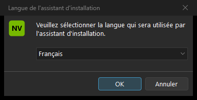

<!-- nv-language-navigation:start -->
🌐 [English](../../../../NVIDIA-Profile-Inspector/README.md) | [Français](../../../../NVIDIA-Profile-Inspector/README.fr.md) · [NV Laboratory](../README.md)

🌐 Language · 34

[العربية](../../ar/NVIDIA-Profile-Inspector/README.md) · [বাংলা](../../bn/NVIDIA-Profile-Inspector/README.md) · [简体中文](../../zh/NVIDIA-Profile-Inspector/README.md) · [Čeština](../../cs/NVIDIA-Profile-Inspector/README.md) · [Dansk](../../da/NVIDIA-Profile-Inspector/README.md) · [Nederlands](../../nl/NVIDIA-Profile-Inspector/README.md) · [English](../../../../NVIDIA-Profile-Inspector/README.md) · [Filipino](../../fil/NVIDIA-Profile-Inspector/README.md) · [Suomi](../../fi/NVIDIA-Profile-Inspector/README.md) · [Français](../../../../NVIDIA-Profile-Inspector/README.fr.md) · [Deutsch](../../de/NVIDIA-Profile-Inspector/README.md) · [Ελληνικά](../../el/NVIDIA-Profile-Inspector/README.md) · [हिन्दी](../../hi/NVIDIA-Profile-Inspector/README.md) · [Magyar](../../hu/NVIDIA-Profile-Inspector/README.md) · [Bahasa Indonesia](../../id/NVIDIA-Profile-Inspector/README.md) · [Italiano](../../it/NVIDIA-Profile-Inspector/README.md) · [日本語](../../ja/NVIDIA-Profile-Inspector/README.md) · [한국어](../../ko/NVIDIA-Profile-Inspector/README.md) · [मराठी](../../mr/NVIDIA-Profile-Inspector/README.md) · [فارسی](../../fa/NVIDIA-Profile-Inspector/README.md) · [Polski](../../pl/NVIDIA-Profile-Inspector/README.md) · [Português](../../pt/NVIDIA-Profile-Inspector/README.md) · [ਪੰਜਾਬੀ](../../pa/NVIDIA-Profile-Inspector/README.md) · [Română](../../ro/NVIDIA-Profile-Inspector/README.md) · [Русский](../../ru/NVIDIA-Profile-Inspector/README.md) · [Español](../../es/NVIDIA-Profile-Inspector/README.md) · **Kiswahili** · [Svenska](../../sv/NVIDIA-Profile-Inspector/README.md) · [தமிழ்](../../ta/NVIDIA-Profile-Inspector/README.md) · [ไทย](../../th/NVIDIA-Profile-Inspector/README.md) · [Türkçe](../../tr/NVIDIA-Profile-Inspector/README.md) · [Українська](../../uk/NVIDIA-Profile-Inspector/README.md) · [اردو](../../ur/NVIDIA-Profile-Inspector/README.md) · [Tiếng Việt](../../vi/NVIDIA-Profile-Inspector/README.md)

[Translation policy](../../README.md)

<!-- nv-language-navigation:end -->

<!-- nv-translation-notice:start -->
> Tafsiri inayosaidiwa na mashine kutoka kwa Kiingereza. Majina ya kiufundi, amri, URL na maandishi asili ya kisheria yanahifadhiwa. Uhakiki wa mzungumzaji asilia unakaribishwa; angalia rejeleo la Kiingereza ikiwa maneno hayako wazi.
<!-- nv-translation-notice:end -->

# NVIDIA Profile Inspector – NV Tools Fork

**fork huru ya [NVIDIA Profile Inspector kwa Orbmu2k](https://github.com/Orbmu2k/nvidiaProfileInspector), iliyo na vidhibiti vilivyoongezwa vya kuonyesha.** Jina la mradi wa awali: **NVPI Custom**.

[Pakua na uchapishe hali](../docs/downloads.md#nvidia-profile-inspector) · [Ufungaji](#installation) · [Juu na mabadiliko](#upstream-and-changes) · [Leseni](../../../../NVIDIA-Profile-Inspector/LICENSE)

## Muhtasari

Programu huhariri wasifu wa viendeshaji wa NVIDIA, ikijumuisha mipangilio ya kila programu. fork hii pia inaongeza kihariri cha **Skrini** kwa onyesho amilifu la Windows: azimio, kiwango cha kuonyesha upya, mipangilio ya rangi ya matokeo, HDR na kusakinisha miunganisho ya wasifu wa ICC/WCS.

Inapatikana ili kuleta vidhibiti vinavyohusiana vya kuonyesha kwenye kihariri cha wasifu na kufanya onyesho la kukagua, uthibitisho na urejeshaji matokeo kuwa wazi zaidi. Haianzisha uwezo mpya wa vifaa.

Mtahiniwa wa kwanza ni **3.0.2.3**, kwa kutumia muundo shirikishi uliosafishwa kuanzia Septemba 9, 2026. Inayoweza kutekelezeka inasalia `nvidiaProfileInspector.exe`; kisakinishi na lebo zingine za ndani bado zinasema `NVPI Custom NV`. Kichwa cha umma hapo juu kinatambulisha fork bila kubadilisha utambulisho wa usakinishaji au kujifanya kuwa ni toleo rasmi la Orbmu2k.

## Vipengele

- Uvinjari uliopo wa wasifu, miunganisho ya programu, uhariri wa mipangilio na uagizaji/usafirishaji wa wasifu.
- **Skrini** kidirisha cha onyesho, modi, Hz, RGB/YCbCr, kina cha rangi, anuwai na upimaji rangi.
- Windows HDR kudhibiti na kusakinisha ICC/WCS uteuzi wa chama.
- Onyesho la kukagua onyesho la sekunde 15 lenye **Weka** / **Rejesha** na urejeshaji wa muda umekwisha.
- Kusoma nyuma kwa modi/HDR mabadiliko na kuripotiwa kushindwa kwa urejeshaji.
- Ripoti tofauti za HDR, SDR yenye ACM/WCG na kina cha rangi ya mawimbi.
- Kizindua cha NVRasterPulse kwa nakala inayostahiki iliyosakinishwa kando.

## Utangamano

| Sharti | Maelezo |
| --- | --- |
| Mfumo | Windows 10/11 x64 na dereva sambamba wa NVIDIA |
| Muda wa kukimbia | [NET Framework 4.8](https://dotnet.microsoft.com/en-us/download/dotnet-framework/net48), iliyotolewa na Windows au imewekwa kando |
| Ruhusa | Kihariri huomba ufikiaji wa msimamizi kinapofunguliwa |
| Maonyesho | Aina halisi na mchanganyiko wa rangi hutegemea GPU, kiendeshi, onyesho, kebo na API za Windows |
| Zana za hiari | NVRasterPulse kwa usimamizi wa kikomo wa RTSS; wala RTSS haihitajiki kwa kihariri cha Skrini |
| Lugha | Mipangilio: kichaguzi cha lugha 34. Mhariri huhifadhi usaidizi wake wa lugha uliopo. |

Hakuna kiwango cha chini kabisa cha kiendeshi kilichothibitishwa au matrix ya usaidizi kwa kila GPU. Chaguo za bpc zinazopatikana kwenye kidirisha ni maombi, si michanganyiko iliyoidhinishwa. Vidhibiti vya kisasa vya HDR na mfumo mbadala wa zamani wa Windows vina uwezo tofauti.

## Ufungaji

1. Fungua [ukurasa wa kupakua](../docs/downloads.md#nvidia-profile-inspector) na uangalie hali ya uchapishaji.
2. Pakua Mipangilio au kipengee cha kubebeka na ulinganishe SHA-256 yake na faili ya maelezo ya Toleo.
3. Kwa Usanidi, endesha `NVPI-CustomNV-3.0.2.3-Setup-r2.exe`, chagua lugha na ufuate kisakinishi. Inaunda njia yake ya mkato na kiondoa.
4. Kwa kubebeka, toa ZIP kamili kwenye folda mpya inayoweza kuandikwa. Weka `Reference.xml`, usanidi wa EXE na arifa zote kando ya inayoweza kutekelezwa.
5. Zindua `nvidiaProfileInspector.exe`.

Kusakinisha kihariri pekee hakutumii wasifu au kusakinisha kiendeshi cha GPU. Sahaba husakinisha kivyake, haichukui miungano ya `.nip` na haiwashi uanzishaji wakati wa kuingia. Jozi zilizopo hazijatiwa saini.

## Matumizi

**Marekebisho ya kisakinishi 2** huongeza kiteuzi kile kile cha lugha 34 kama zana zingine, kwa urambazaji wa kipanya/kibodi, mwonekano mwepesi/giza na kughairiwa. Chaguo linatumika kwa kuanzisha; haitafsiri mhariri wa NVPI. Hoja dhahiri ya `/LANG=fr` au hali ya kimya hupita uteuzi kwa wapigaji simu ambao tayari wanatoa lugha.

**Wasifu wa kiendeshaji:** chagua wasifu, hamisha nakala rudufu, kisha uhariri mipangilio iliyokusudiwa tu na uitumie. Mashirika ya maombi huamua ni mchezo gani unaopokea wasifu. Thamani iliyohifadhiwa sio uthibitisho kwamba kila dereva au mchezo huitumia.

**Vidhibiti vya onyesho:** fungua **Skrini**, chagua onyesho na thamani ulizoomba, kisha uanze onyesho la kukagua. Angalia picha kabla ya kuchagua **Weka** ndani ya sekunde 15. Tumia **Rejesha**, funga uthibitishaji au uiruhusu muda wake uishe ili kuomba kurejeshwa. Soma ujumbe wowote wa kutofaulu: simu iliyofanikiwa ya API pekee sio dhibitisho la kurejeshwa.

Uchaguzi wa ICC hubadilisha muungano wa wasifu uliosakinishwa; haizalishi, kusawazisha au kusambaza tena faili ya ICC. HDR, ACM/WCG, RGB/YCbCr na bpc zinaelezea vipengele tofauti vya bomba. Hakuna swichi mpya huru ya ACM iliyotolewa.

**NVRasterPulse:** kitufe cha upau wa vidhibiti kinakubali usakinishaji uliosajiliwa tofauti wa mfumo mzima chini ya Faili za Programu zilizo na umiliki na ruhusa zinazolindwa. Nakala inayoweza kubebeka au njia inayoweza kuandikwa/iliyounganishwa na mtumiaji inaweza kukataliwa na kizindua hiki cha juu. Katika hali hiyo fungua NVRasterPulse kwa kutumia njia yake ya mkato. [Sakinisha RTSS kando](https://www.guru3d.com/download/rtss-rivatuner-statistics-server-download/) kutumia NVRasterPulse.

## Picha za skrini

Kiteuzi halisi cha usanidi kwa Kifaransa, kilinaswa wakati wa jaribio la pekee na kisha kughairiwa. Hii inaonyesha kisakinishi; mhariri huhifadhi kiolesura chake na mazungumzo ya Skrini.

## Sasisha na uondoe

Funga kihariri kabla ya kusasisha. Weka profaili zilizosafirishwa na upakue Toleo jipya la fork; sakinisha juu ya utambulisho mwenza sawa au utoe faili zinazobebeka kwenye folda mpya. Usichanganye `Reference.xml` ya zamani na inayoweza kutekelezeka. Ukandamizaji wa ukaguzi wa sasisho wa mkondo uliounganishwa ni wa fork hii.

Kwa nakala iliyosakinishwa, tumia Windows Installed apps na kiondoaji chake. Kwa kubebeka, ifunge na uondoe folda yake iliyotolewa wakati bidhaa zako za kuhamishwa ziko salama. Kuondoa kihariri hakutengui uhariri wa wasifu wa kiendeshi, mapendeleo ya kuonyesha, NVRasterPulse au RTSS. Rejesha mipangilio inayotaka kabla ya kuondolewa.

## Vikwazo vinavyojulikana

- Uthibitisho wa sekunde 15 sio mlinzi wa kila ajali ya dereva, kupoteza nguvu au kuzima kwa lazima.
- Baadhi ya mchanganyiko wa rangi/kina/onyesha upya hurejesha `NVAPI_NOT_SUPPORTED`.
- Usomaji wa programu haupimi kina kidogo cha paneli, usahihi wa rangi au muda wa kusubiri.
- Mipangilio ya skrini huathiri onyesho la sasa la Windows; kidirisha hiki hakiundi mipangilio ya awali ya onyesho la kila mchezo.
- Hakuna utendakazi, uzuiaji wa kudanganya au dhamana ya utangamano ya HDR kwa wote.

## Kutatua matatizo

| Dalili | Kitendo |
| --- | --- |
| Hitilafu ya muda wa kukimbia wakati wa uzinduzi | Angalia sasisho za Windows na NET Framework 4.8; tumia kifurushi kamili. |
| Hali ya onyesho iliyoombwa imekataliwa | Rejesha na ujaribu modi inayotolewa na Windows/NVIDIA kwa onyesho hilo. Soma kosa halisi na uepuke mabadiliko ya kipofu mara kwa mara. |
| HDR au rangi inarudi kwa hali ya zamani | Angalia ikiwa operesheni nyingine haikufaulu na kuanzisha urejeshaji; kutofautisha HDR kutoka ACM. |
| Kitufe cha NVRasterPulse kinakataa njia | Zindua njia yake ya mkato; kitufe hiki kinahitaji usakinishaji wa mfumo mzima unaolindwa. |
| Mabadiliko yanasalia baada ya kusanidua | Rejesha wasifu wa NVIDIA uliosafirishwa au mipangilio ya onyesho ya Windows iliyokusudiwa; Kuondoa sio kurudisha nyuma mipangilio. |

Tazama [mwongozo wa usaidizi wa pamoja](../docs/support.md) kabla ya kutuma kumbukumbu.

## Maswali Yanayoulizwa Mara kwa Mara

**Je, hii ni programu rasmi ya NVIDIA au muundo rasmi wa Orbmu2k?** Hapana. Ni fork inayojitegemea; mwandishi wa mkondo wa juu na leseni ya MIT inasalia kuhesabiwa.

**Je, NVDriverForge inahitaji kihariri hiki?** Hapana. Uwekaji awali wa NVDriverForge wa hiari wa Custom NV hutumia ujumuishaji wake. Kufunga kihariri ni chaguo tofauti.

**Je, RTSS ni lazima kwa fork hii?** Nambari ya RTSS ni ya lazima kwa kikomo cha NVRasterPulse cha FPS, si kwa wasifu au uhariri wa Skrini.

**Chanzo kiko wapi?** Chanzo cha programu kilichobadilishwa hudumishwa kwa faragha. Notisi ya MIT na hazina ya juu ya mkondo hutolewa; MIT haihitaji kuchapisha chanzo kilichorekebishwa.

## Juu na mabadiliko

Mkondo wa juu: [Orbmu2k/nvidiaProfileInspector](https://github.com/Orbmu2k/nvidiaProfileInspector), ahadi ya kumbukumbu `592d962cca8827efe8859461a84267755595064a`. [Vipakuliwa asili](https://github.com/Orbmu2k/nvidiaProfileInspector/releases).

Iliyorithiwa: kihariri cha wasifu, NVAPI interop, data ya marejeleo, rasilimali za UI na mandhari. 禅堂 Zendo (RevoluSound Team) imeongezwa au kubadilishwa huduma za kuonyesha, miamala ya HDR/ICC, uthibitishaji wa sekunde 15/kusoma nyuma, mpangilio wa upau wa vidhibiti na tabia ya uzinduzi wa RasterPulse. Sahaba iliyosafishwa haijumuishi mada za ukuzaji/viingilio vya majaribio, hutumia kizindua cha nje kilicholindwa na hutoa kisakinishi tofauti. Kifurushi cha zamani cha ukuzaji cha NVPI/RasterPulse sio mgombeaji katika kitovu hiki.

[Utangulizi wa kina wa faili](../docs/provenance.md) · [Notisi ya asili ya fork](../../../../NVIDIA-Profile-Inspector/LICENSES/ORIGINAL-FORK-NOTICE.txt)

## Mikopo na leseni

Hakimiliki (c) 2016 Orbmu2k. [Leseni ya MIT](../../../../NVIDIA-Profile-Inspector/LICENSE) iliyotolewa imehifadhiwa. Marekebisho na ufungaji: 禅堂 Zendo (RevoluSound Team). Kisakinishi hutumia Inno Setup; Windows na .NET Framework zinasalia nje. [Arifa kamili zinazotumika](LICENSES/README.md).

Haijalishi, haijafadhiliwa na, na haijaidhinishwa rasmi na NVIDIA Corporation. Alama za biashara hubaki na wamiliki husika.
