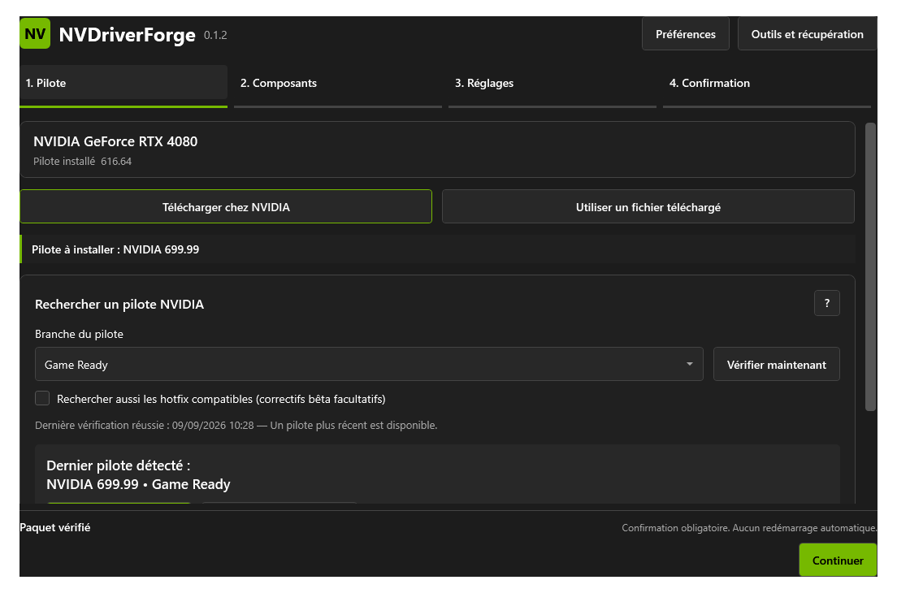

<!-- nv-language-navigation:start -->
🌐 [English](../../../../NVDriverForge/README.md) | [Français](../../../../NVDriverForge/README.fr.md) · [NV Laboratory](../README.md)

🌐 Language · 34

[العربية](../../ar/NVDriverForge/README.md) · [বাংলা](../../bn/NVDriverForge/README.md) · [简体中文](../../zh/NVDriverForge/README.md) · [Čeština](../../cs/NVDriverForge/README.md) · [Dansk](../../da/NVDriverForge/README.md) · [Nederlands](../../nl/NVDriverForge/README.md) · [English](../../../../NVDriverForge/README.md) · [Filipino](../../fil/NVDriverForge/README.md) · [Suomi](../../fi/NVDriverForge/README.md) · [Français](../../../../NVDriverForge/README.fr.md) · [Deutsch](../../de/NVDriverForge/README.md) · [Ελληνικά](../../el/NVDriverForge/README.md) · [हिन्दी](../../hi/NVDriverForge/README.md) · [Magyar](../../hu/NVDriverForge/README.md) · [Bahasa Indonesia](../../id/NVDriverForge/README.md) · [Italiano](../../it/NVDriverForge/README.md) · [日本語](../../ja/NVDriverForge/README.md) · [한국어](../../ko/NVDriverForge/README.md) · [मराठी](../../mr/NVDriverForge/README.md) · [فارسی](../../fa/NVDriverForge/README.md) · [Polski](../../pl/NVDriverForge/README.md) · [Português](../../pt/NVDriverForge/README.md) · [ਪੰਜਾਬੀ](../../pa/NVDriverForge/README.md) · [Română](../../ro/NVDriverForge/README.md) · [Русский](../../ru/NVDriverForge/README.md) · [Español](../../es/NVDriverForge/README.md) · [Kiswahili](../../sw/NVDriverForge/README.md) · [Svenska](../../sv/NVDriverForge/README.md) · [தமிழ்](../../ta/NVDriverForge/README.md) · [ไทย](../../th/NVDriverForge/README.md) · [Türkçe](../../tr/NVDriverForge/README.md) · [Українська](../../uk/NVDriverForge/README.md) · **اردو** · [Tiếng Việt](../../vi/NVDriverForge/README.md)

[Translation policy](../../README.md)

<!-- nv-language-navigation:end -->

<!-- nv-translation-notice:start -->
> انگریزی سے مشین کی مدد سے ترجمہ۔ تکنیکی نام، کمانڈ، یو آر ایل اور اصل قانونی متن محفوظ ہیں۔ مقامی بولنے والے کا جائزہ خوش آئند ہے۔ اگر الفاظ واضح نہیں ہیں تو انگریزی حوالہ سے مشورہ کریں۔
<!-- nv-translation-notice:end -->

# NVDriverForge

**ایک NVIDIA ڈرائیور کی تنصیب کو واضح اجزاء کے انتخاب اور اختیاری ترتیبات کے ساتھ تیار کریں۔**

[0.1.4 اور اسٹیٹس ڈاؤن لوڈ کریں۔](../docs/downloads.md#nvdriverforge) · [تنصیب](#installation) · [کریڈٹس](#credits-and-upstream) · [لائسنس](../../../../NVDriverForge/LICENSE)

## جائزہ اور مقصد

NVDriverForge اصل NVIDIA ڈرائیور پیکج کے ذریعے آپ کی رہنمائی کرتا ہے: ڈرائیور کا انتخاب کریں، اس کے اجزاء کا معائنہ کریں، اختیاری موافقت کا جائزہ لیں، پھر انسٹالیشن کی تصدیق کریں۔ یہ ان انتخابوں کو قابل فہم بنانے اور انسٹالیشن، مراعات یافتہ آپریشنز اور ریکوری کی معلومات کو ایک ساتھ رکھنے کے لیے موجود ہے۔

یہ ایک آزادانہ طور پر تیار کردہ ایپلیکیشن ہے جو NVCleanstall کے ورک فلو سے متاثر ہے۔ اس میں NVCleanstall شامل نہیں ہے یا مکمل فیچر برابری کا دعویٰ نہیں کرتا ہے۔

## خصوصیات

- NVIDIA Game Ready / Studio تلاش اور ڈاؤن لوڈز؛ دستی فال بیک کے ساتھ اختیاری ہاٹ فکس دریافت۔
- اصل پیکیج، ہیشز، NVIDIA دستخطوں، مینی فیسٹس اور مطابقت پذیر INF اندراجات کا تجزیہ۔
- انحصار اور نامعلوم اجزاء کے تحفظ کے ساتھ اجزاء کا انتخاب۔
- ورژن 0.1.4 منتخب اختیاری NVIDIA اجزاء کو چھوڑنے کے قابل رکھتا ہے اور دریافت سے صرف تصدیق شدہ غیر چیک شدہ اجزاء کو خارج کرتا ہے۔ پہلے سے موجودہ یا غیر قابل اطلاق اختیاری رن ٹائمز کو اب اہم اجزاء کے طور پر مجبور نہیں کیا جاتا ہے۔
- تمام 34 زبانوں میں انسٹالیشن کی ناکامی کے خلاصے اور تفصیلی لاگز تک رسائی کو صاف کریں۔
- تنصیب سے پہلے تیاری کی جانچ، واضح تصدیق، ڈرائیور اسٹور ایکسپورٹ اور مقامی NVIDIA پروفائل بیک اپ۔
- پری فلائٹ چیکس، جرائد اور تنازعات سے آگاہ ریکوری کے ساتھ اختیاری جدید ترتیبات۔
- اختیاری **Custom NV** نامزد انتخاب اور وضاحتوں کے ساتھ پیش سیٹ، بشمول ایک علیحدہ SILK طاقت کا انتخاب اور مطابقت کی جانچ۔
- اختیاری عین مطابق ورژن NVENC پیچ ڈاؤن لوڈز؛ سورس کمٹ اور ٹارگٹ بائٹس کو چیک کیا جاتا ہے۔
- ٹولز اسکرین سے Profile Inspector fork کی علیحدہ، اختیاری تنصیب۔
- اجزاء گائیڈ، دوبارہ قابل استعمال ترجیحات، ڈرائیور کٹس، مقامی سپورٹ رپورٹس اور اختیاری ایپلیکیشن اپ ڈیٹس۔
- 34 انٹرفیس زبانیں اور چار تھیمز۔

دستیاب اعلی درجے کے اختیارات MPO، DLSS اشارے، Ansel، NVIDIA آڈیو سلیپ، MSI، انٹرپٹ پالیسی/ترجیح، HDCP، ڈسپلے کنٹینر اسٹارٹ اپ اور ایک اہل لیگیسی ٹیلی میٹری سروس سے متعلق ہیں۔ ہر ایک کی اپنی شرائط اور اثرات ہیں۔ یہ عالمی کارکردگی میں بہتری نہیں ہیں۔

## مطابقت

| ضرورت | تفصیلات |
| --- | --- |
| سسٹم | Windows 10 کی تعمیر 19041 یا جدید ترین / Windows 11، x64 |
| GPU/ڈرائیور | ہم آہنگ NVIDIA پیکج اور ہارڈ ویئر کا پتہ چلا؛ خودکار کیٹلاگ تلاش بنیادی طور پر معروف GeForce ماڈلز کا احاطہ کرتی ہے۔ |
| رن ٹائم | .NET 8 / WPF 8.0.31 تیار کردہ خود ساختہ پیکیج میں شامل ہے |
| مراعات | عمومی UI/فی صارف سیٹ اپ؛ ڈرائیور کی تنصیب اور نظام کی تبدیلیاں منتظم تک رسائی کی درخواست کرتی ہیں۔ |
| نیٹ ورک | آن لائن NVIDIA تلاش/ڈاؤن لوڈز اور واضح اپ اسٹریم NVENC درخواستوں کے لیے درکار ہے۔ ایک مقامی اصل ڈرائیور کا انتخاب کیا جا سکتا ہے۔ |
| شامل ٹولز | غیر ترمیم شدہ 7-Zip 26.03، رن ٹائم نوٹس، اختیاری MIT Profile Inspector ساتھی |
| اختیاری ساتھی | NET فریم ورک 4.8 علیحدہ Profile Inspector fork کے لیے |

کوئی من مانی کم از کم ڈرائیور ورژن تمام خصوصیات کا احاطہ نہیں کرتا ہے۔ ملٹی GPU تلاش کا ہر پتہ چلنے والے GPU سے مماثل ہونا چاہیے۔ غیر تعاون یافتہ/پیشہ ور ماڈلز کو دستی ڈرائیور کے انتخاب کی ضرورت پڑ سکتی ہے۔ NVIDIA کا انسٹالر حتمی ہارڈ ویئر/OS اتھارٹی ہے۔

## تنصیب

1. [ڈاؤن لوڈز](../docs/downloads.md#nvdriverforge) پر جائیں اور ریلیز کے شائع ہونے کی تصدیق کریں۔
2. تنصیب کے لیے `NVDriverForge-Setup.exe`، یا پورٹیبل استعمال کے لیے `NVDriverForge.exe` کا انتخاب کریں۔
3. SHA-256 کا ریلیز کے `SHA256SUMS.txt` سے موازنہ کریں۔
4. فی یوزر انسٹالیشن اور معیاری ان انسٹالر کے لیے سیٹ اپ چلائیں، یا پورٹیبل EXE کو قابل تحریر فولڈر میں رکھیں اور اسے کھولیں۔

پورٹیبل میں اس کا رن ٹائم اور اس کا اختیاری انسٹالر شامل ہے۔ NVDriverForge انسٹال کرنے سے GPU ڈرائیور انسٹال نہیں ہوتا ہے۔ اس کے EXEs فی الحال غیر دستخط شدہ ہیں۔

## استعمال

1. **ڈرائیور:** NVIDIA سے ڈاؤن لوڈ کریں یا اصلی NVIDIA انسٹالر EXE منتخب کریں۔ تجزیہ ختم ہونے دیں۔
2. **اجزاء:** تفصیل اور مطلوبہ انحصار کا جائزہ لیں۔ نامعلوم اجزاء کو برقرار رکھا گیا ہے۔
3. ** موافقت:** ناپسندیدہ اختیارات کو بغیر کسی تبدیلی کے چھوڑ دیں۔ کسی بھی چیز کو منتخب کرنے سے پہلے اثرات اور تجارت کو پڑھیں۔
4. **جائزہ:** درست ڈرائیور، اجزاء اور اختیاری آپریشنز کو چیک کریں، پھر انسٹالیشن کی تصدیق کریں۔
5. UAC کو صرف آپ کے منتخب کردہ آپریشن کے لیے قبول کریں۔ محفوظ کام کی بازیابی کی ہدایات رکھیں۔
6. اگر نئے ڈرائیور کو دوبارہ شروع کرنے کی ضرورت ہے تو، رپورٹ کردہ حالت پر عمل کریں۔ اس کے دوبارہ شروع ہونے کے بعد موخر شدہ کارروائیوں کو واضح طور پر دوبارہ شروع کرنے کی ضرورت ہوتی ہے۔

Custom NV بغیر تبدیلی کے شروع ہوتا ہے۔ انفرادی نامزد اقدار کا انتخاب کریں یا فراہم کردہ پیش سیٹ اور اس کے اخراج کا جائزہ لیں۔ اس کے دو معلوماتی داخلی شعبے آزادانہ طور پر نہیں لکھے گئے ہیں۔ ترتیبات کا اطلاق صرف تصدیق شدہ نئے ڈرائیور کے ورک فلو میں ہوتا ہے، کبھی بھی پیش نظارہ کھول کر نہیں۔ علیحدہ NVPI ایڈیٹر انسٹال کرنے کی ضرورت نہیں ہے۔

اختیاری NVENC کام پن کیے ہوئے keylase کمٹ سے ہم آہنگ ڈیٹا ڈاؤن لوڈ کرتا ہے۔ یہ دو ڈرائیور DLL کو تبدیل کرتا ہے اور ان کے دستخطوں کو باطل کر دیتا ہے۔ Windows، انکوڈرز، DRM یا اینٹی چیٹ کے ذریعے اس سے انکار کیا جا سکتا ہے۔ ایسا کوئی ڈیٹا یا NVIDIA DLL NVDriverForge میں سرایت شدہ نہیں ہے۔ [پرووننس اور لائسنسنگ کی حدود](../docs/provenance.md)۔

ترجیحات زبان، تھیم اور اختیاری انسٹال کردہ صارف اپ ڈیٹ چیک کو کنٹرول کرتی ہیں۔ پورٹیبل نصب شدہ پس منظر کی جانچ کا کام نہیں بناتا ہے۔ ٹولز اور ریکوری انسٹالیشن کے چار مراحل سے الگ ہیں۔

## بیک اپ اور تشخیصی ٹولز

**انسٹالیشن سے پہلے:** تیاری کی جانچ میں پیکیج کے دستخط، GPUs، تخمینہ شدہ ورک اسپیس/بیک اپ اسپیس، زیر التواء ری اسٹارٹ اور مقابلہ کرنے والے انسٹالرز شامل ہیں۔ اونچا کارکن انہیں دہراتا ہے۔ مسابقتی عمل کبھی خود بخود بند نہیں ہوتے۔ NVIDIA سیٹ اپ شروع ہونے سے پہلے مقامی NVIDIA پروفائل ڈیٹا بیس کا بیک اپ کامیاب ہونا چاہیے۔ ڈرائیور اسٹور ایکسپورٹ ایک الگ بیک اپ ہے۔

**دوبارہ استعمال کے قابل انتخاب:** اجزاء گائیڈ گیمز، آڈیو، NVIDIA App اور ریکارڈنگ کے بارے میں چار سوالات پوچھتا ہے۔ اس کی تجاویز کا جائزہ لیں؛ مطلوبہ، نامعلوم اور انحصار کے اجزاء محفوظ رہتے ہیں۔ ترجیحات کو برآمد کریں، پھر درآمد کرتے وقت ان کا پیش نظارہ کریں اور منتخب پیکیج کے خلاف ان کی تصدیق کریں۔ رضامندی، دوبارہ شروع کی کارروائیاں، پروگرام کے راستے اور پیچ پے لوڈ درآمد نہیں کیے جاتے ہیں۔

**ڈرائیور کٹ:** اصل دستخط شدہ NVIDIA انسٹالر، انتخاب، ہیشز اور ہدایات کو ساتھ رکھنے کے لیے ایک `.nvdfkit.zip` برآمد کریں۔ الگ سے `NVDriverForge.exe` ساتھ رکھیں۔ ٹولز میں کٹ درآمد کریں، پیش نظارہ کا جائزہ لیں، پھر عام انسٹالیشن ورک فلو استعمال کریں۔ یہ سلم ڈرائیور یا ترمیم شدہ اسٹینڈ اسٹون انسٹالر نہیں ہے۔ اختیاری NVENC کو ابھی بھی اس عین ڈرائیور کے لیے ڈاؤن لوڈ اور رضامندی کی ضرورت ہے۔ NVIDIA کی دوبارہ تقسیم کی شرائط اب بھی لاگو ہیں۔

**نتائج اور تعاون:** مختصر نتیجہ پڑھیں اور فی اسٹیج/فی آپشن کی تفصیلات کو پھیلائیں۔ کامیاب ریڈ بیک ایک ذخیرہ شدہ قدر قائم کرتا ہے، نہ کہ پیمائش شدہ بہتری۔ مقامی JSON سپورٹ رپورٹ اجازت یافتہ فیلڈز کا استعمال کرتی ہے، بشمول ایپ کو دوبارہ شروع کرنے کے بعد آخری محفوظ کردہ جاب۔ محفوظ کرنے یا شیئر کرنے سے پہلے اس کا جائزہ لیں۔ اس میں کوئی خام لاگ، پروفائل مواد یا ہارڈویئر شناخت کنندہ شامل نہیں ہے اور یہ کبھی خود بخود اپ لوڈ نہیں ہوتا ہے۔

**ریکوری:** بیک اپ ڈرائیور کی بازیابی کے لیے محفوظ جاب کی گائیڈ پر عمل کریں۔ واضح پروفائل کی بحالی کے لیے اصل ڈرائیور ورژن اور اسی GPUs کی ضرورت ہوتی ہے۔ یہ پورے ڈیٹا بیس کی جگہ لے لیتا ہے، موجودہ کاپی کو محفوظ رکھتا ہے، اور ہیش اور متضاد حالت کو چیک کرتا ہے۔ اس کے جریدے کو نہ مٹایں اور نہ ہی کسی مماثلت پر مجبور کریں۔ اس نئے ورک فلو کے ساتھ حقیقی ڈرائیور کی تنصیب، مکمل ریکوری اور مقامی پروفائل کی درآمد حقیقی سسٹم پر غیر تصدیق شدہ رہتی ہے۔

**ایپلی کیشن اپ ڈیٹس:** ریلیز نوٹس پڑھیں، پھر واضح طور پر SHA-256 سے تصدیق شدہ ڈاؤن لوڈ کا انتخاب کریں۔ چیکنگ بذریعہ ڈیفالٹ دستی ہے، آغاز پر اختیاری چیک کے ساتھ۔ کوئی انسٹالر خود بخود شروع نہیں ہوتا ہے۔ یہ فیچر ڈرائیور اپ ڈیٹ چیک اور انسٹال شدہ ایڈیشن کے اختیاری ڈرائیور چیک ٹاسک سے الگ ہے۔

## اسکرین شاٹس

مثال کے اعداد و شمار کے ساتھ موجودہ 0.1.2 فرانسیسی UI رینڈر؛ ایک انٹرفیس پیش نظارہ کے طور پر برقرار رکھا. دکھایا گیا 699.99 ڈرائیور ایک ٹیسٹ فکسچر ہے، ڈاؤن لوڈ کرنے کے لیے حقیقی ورژن نہیں۔ [تصویر کی اصل](../assets/README.md)۔

## اپ ڈیٹ اور ان انسٹال کریں۔

NVDriverForge کو بند کریں، اگلا آفیشل پیکج حاصل کریں اور اس کی ہیش کی تصدیق کریں۔ انسٹال شدہ اپ ڈیٹ کے لیے وہی سیٹ اپ شناخت استعمال کریں۔ ایک بند پورٹیبل EXE کو نئے سے تبدیل کریں۔ ترتیبات اور محفوظ ملازمتیں رکھیں۔

Uninstall سے Windows **Installed apps**۔ یہ ایپ اور اس کے اپ ڈیٹ ٹاسک کو ہٹاتا ہے، NVIDIA ڈرائیور کو نہیں۔ ترتیبات، لاگز اور بیک اپ باقی ہیں۔ اگر چاہیں تو، ایپ کو ہٹانے سے **پہلے** دستاویزی ریکوری فلو کے ذریعے ایڈوانسڈ/NVENC تبدیلیاں بحال کریں۔ بحال کرنا دوسرے ٹول سے متضاد تبدیلیوں سے انکار کرتا ہے۔

مقامی ڈیٹا `%LOCALAPPDATA%\NVDriverForge` کے تحت ہے۔ محفوظ ملازمتیں اور ڈرائیور کی برآمدات `%PROGRAMDATA%\NVDriverForge\Jobs` کے تحت ہیں۔ پورٹ ایبل استعمال مقامی ڈیٹا بھی بناتا ہے۔ ڈرائیور اسٹور ایکسپورٹ اور مقامی پروفائل بیک اپ الگ الگ ہیں۔ نہ ہی نظام کی تصویر ہے۔

## معلوم حدود

- کوئی ہارڈ ویئر اضافہ/INF ایڈیٹنگ، دوبارہ تیار کردہ NVIDIA دستخط، اینٹی چیٹ سے مطابقت پذیر استعفیٰ یا خودکار طور پر غیر دستخط شدہ وارننگ قبولیت۔
- کوئی مکمل ٹیلی میٹری/اشتہار ہٹانا، سلم پیکج برآمد یا پچھلے ڈرائیور کو خودکار مکمل رول بیک نہیں۔
- ہب آڈٹ کے ذریعے حقیقی مشینوں پر ڈرائیور کی تنصیب، بوٹ ریکوری اور اختیاری پروفائل تحریروں کی جامع طور پر توثیق نہیں کی گئی ہے۔
- رجسٹری ریڈ بیک اصل HDCP، کارکردگی یا تاخیر کے اثرات کا ثبوت نہیں ہے۔
- دستخطی چیک مقامی طور پر دستیاب Windows اعتماد کا استعمال کرتے ہیں۔ آن لائن منسوخی نہیں کی جاتی ہے۔
- 34 زبانیں موجود ہیں، لیکن مکمل مقامی بولنے والے/قابل رسائی ٹیسٹنگ نامکمل ہے۔

## خرابی کا سراغ لگانا

| علامت | ایکشن |
| --- | --- |
| آن لائن کیٹلاگ دستیاب نہیں ہے۔ | [NVIDIA ڈرائیور ڈاؤن لوڈ](https://www.nvidia.com/en-us/drivers/) سے ایک اصل پیکیج منتخب کریں۔ پڑوسی GPU ماڈل کو تبدیل نہ کریں۔ |
| ہاٹ فکس تلاش دستیاب نہیں ہے۔ | [NVIDIA کا Game Ready ڈرائیور فورم](https://www.nvidia.com/en-us/geforce/forums/game-ready-drivers/13/) استعمال کریں اور اصل پیکیج کی تصدیق کریں۔ |
| NVIDIA کی تنصیب ناکام ہوجاتی ہے۔ | ناکامی کا خلاصہ پڑھیں اور تفصیلی لاگز کھولیں۔ 0.1.4 میں اختیاری اجزاء پہلے سے موجودہ یا غیر لاگو رہ سکتے ہیں۔ ناکام انسٹالز اختیاری موافقت یا کامیابی/دوبارہ شروع کرنے کے بہاؤ کو متحرک نہیں کرتے ہیں۔ |
| دستخط/ہیش/بیک اپ کی ناکامی۔ | اس تنصیب کو روکیں اور غلطی کو برقرار رکھیں؛ خراب ہونے پر دوبارہ اصل پیکیج حاصل کریں۔ |
| آپشن دستیاب نہیں ہے۔ | اس کے ہارڈ ویئر، جزو یا ہدف ڈرائیور کی وجہ پڑھیں؛ اسے غیر تبدیل شدہ رکھیں. |
| دوبارہ شروع کریں یا کام ابھی باقی ہے۔ | ملازمت کی بازیابی کی ہدایات اور واضح ریزیومے استعمال کریں۔ اس کے جریدے کو مت مٹا دیں۔ |
| تنازعات کو بحال کریں۔ | ایک اور ریاست ریکارڈ شدہ لین دین سے مختلف ہے۔ اسے محفوظ کریں اور بحالی پر مجبور کرنے کے بجائے مدد کی درخواست کریں۔ |

رپورٹس کے لیے، منتخب کردہ ٹول ورژن، Windows، GPU، ڈرائیور اور تولیدی مراحل شامل کریں۔ لاگز سے راستوں اور ذاتی تفصیلات کو درست کریں۔ [حمایت](../docs/support.md)۔

## اکثر پوچھے گئے سوالات

**کیا سیٹ اپ گرافکس ڈرائیور کو انسٹال کرتا ہے؟** نہیں، اس کے لیے ایپلیکیشن کا الگ تجزیہ، جائزہ، تصدیق اور اعلیٰ تنصیب کے عمل کی ضرورت ہوتی ہے۔

**کیا مجھے NVCleanstall یا NVPI کی ضرورت ہے؟** نہیں NVCleanstall صرف الہام ہے۔ Profile Inspector ساتھی ایک آزاد اختیاری ایڈیٹر ہے۔

**کیا یہ ہر NVIDIA ڈرائیور کو چھوٹا یا تیز بناتا ہے؟** نہیں، منتخب اجزاء اور شرائط اس بات کا تعین کرتے ہیں کہ کیا تبدیل ہو سکتا ہے۔ کسی ناپے ہوئے منافع کا وعدہ نہیں کیا گیا ہے۔

**ذرائع کہاں ہیں؟** درخواست کے لیے مخصوص ذریعہ اور نجی ٹیسٹ الگ الگ رکھے جاتے ہیں۔ یہ مرکز دستاویزات، بائنریز اور تھرڈ پارٹی سورس لنکس فراہم کرتا ہے جو انتساب/لائسنسنگ کے لیے درکار ہیں۔

## کریڈٹ اور اپ اسٹریم

اصل اطلاق، ورک فلو، لین دین، لوکلائزیشن، بوٹسٹریپ اور موافقت: 禅堂 Zendo (RevoluSound Team)۔

- [NVCleanstall / TechPowerUp](https://www.techpowerup.com/download/techpowerup-nvcleanstall/): ورک فلو پریرتا؛ کوئی ذریعہ یا بائنری درآمد نہیں کیا گیا ہے۔
- [NVIDIA Profile Inspector / Orbmu2k](https://github.com/Orbmu2k/nvidiaProfileInspector): MIT تھیمز، توسیع شدہ NVAPI انٹرفیس حوالہ اور الگ سے پیک کردہ fork۔
- [7-Zip / Igor Pavlov](https://www.7-zip.org/): غیر ترمیم شدہ نکالنے کے اوزار۔
- [Microsoft .NET](https://github.com/dotnet/runtime) اور [WPF](https://github.com/dotnet/wpf): بنڈل رن ٹائم۔
- [Inno Setup](https://jrsoftware.org/isinfo.php): اصل انسٹالر انجن اور کریڈٹ شدہ ترجمہ۔
- [keylase/nvidia-patch](https://github.com/keylase/nvidia-patch): بیرونی اختیاری NVENC ڈیٹا سورس؛ دوبارہ تقسیم کا لائسنس قائم نہیں ہوا۔
- [NVIDIA](https://www.nvidia.com/en-us/drivers/): بیرونی ڈرائیور NVAPI/NVML لائبریریوں کو ڈاؤن لوڈ اور انسٹال کرتا ہے۔

[مکمل اجزاء کی میز](../THIRD_PARTY_NOTICES.md) · [تبدیلیاں اور اصل](../docs/provenance.md)

## لائسنس

[موجودہ بائنری تقسیم کی اجازت](../../../../NVDriverForge/LICENSE) غیر ترمیم شدہ آفیشل ایگزیکیوٹیبلز کو ان کے نوٹس کے ساتھ استعمال اور شیئر کرنے کی اجازت دیتا ہے۔ درخواست کے مخصوص ماخذ کے حقوق محفوظ ہیں۔ یہ علیحدہ فریق ثالث کے لائسنسوں کے ذریعے عطا کردہ حقوق کو محدود نہیں کرتا ہے۔ [مکمل نوٹس](LICENSES/README.md)۔

NVIDIA Corporation، TechPowerUp اور keylase سے آزاد؛ ان کے ذریعہ اسپانسر یا سرکاری طور پر توثیق نہیں کی گئی ہے۔ پروڈکٹ کے نام ان کے مالکان کے ٹریڈ مارک رہتے ہیں۔

